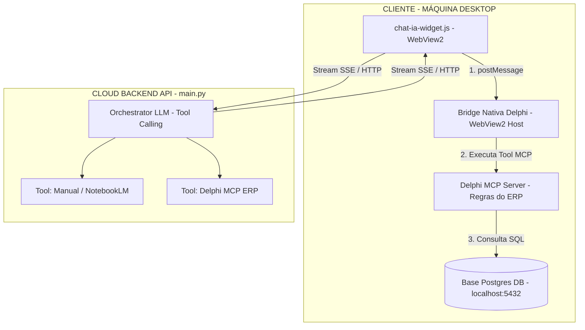
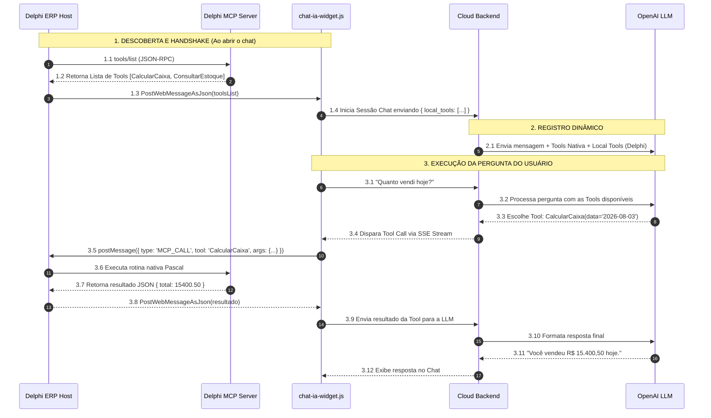

# Arquitetura do Assistente IA para Control Desktop (WebView2 + Delphi MCP)

Este documento especifica a arquitetura e o esquema de comunicação para integração do **Chat IA Widget (`chat-ia-widget.js`)** com a aplicação Desktop **Control (WebView2 + Delphi ERP)** e o backend do Assistente IA.

---

## 1. Visão Geral da Arquitetura (Ponte Nativa WebView2 + Delphi MCP Server)

A solução adota a **Ponte Nativa do WebView2 (*Host Bridge*)** combinada com o **Delphi MCP Server** embutido na aplicação Desktop. Essa abordagem elimina a necessidade de túneis de rede (como Ngrok ou Cloudflare Tunnels), garantindo alta velocidade, custo zero de infraestrutura e total segurança dos dados.



<details>
<summary><b>Clique para ver o Diagrama em Texto (ASCII Format)</b></summary>

```text
                    +-------------------------------------------------------------------+
                    |                      CLIENTE (MÁQUINA DESKTOP)                    |
                    |                                                                   |
                    |  +-------------------------------------------------------------+  |
                    |  |       Aplicação Desktop Control (Delphi ERP Host)          |  |
                    |  |                                                             |  |
                    |  |   +-----------------------+     +-----------------------+   |  |
                    |  |   | WebView2 Container    |     |  Delphi MCP Server    |   |  |
                    |  |   |                       |     |  (Regras do ERP)      |   |  |
                    |  |   |  chat-ia-widget.js    |     |  - Funções de Negócio |   |  |
                    |  |   +-----------+-----------+     |  - Cálculos Avançados |   |  |
                    |  |               |                 |  - Consultas & Dados  |   |  |
                    |  +---------------|-----------------+-----------+-----------+   |  |
                    |                  |                             ^               |  |
                    |                  | (Ponte Nativa WebView2)     | (Executa      |  |
                    |                  v                             |  Tools MCP)   |  |
                    |        Bridge Nativa Delphi (WebView2) --------+               |  |
                    |                  |                                             |  |
                    |                  +-----------------------+                     |  |
                    |                                          | (Acesso direto)     |  |
                    |                                          v                     |  |
                    |                                 +------------------+           |  |
                    |                                 | Base Postgres DB |           |  |
                    |                                 | (localhost:5432) |           |  |
                    |                                 +------------------+           |  |
                    +------------------------------------------|------------------------+
                                                               |
                                                               | Stream SSE / HTTP (HTTPS)
                                                               v
                                                   +-----------------------+
                                                   | Cloud Backend API     |
                                                   | (main.py)             |
                                                   |                       |
                                                   | +-------------------+ |
                                                   | | Orchestrator LLM  | |
                                                   | | (Tool Calling)    | |
                                                   | +----+---------+----+ |
                                                   +------|---------|------+
                                                          |         |
                                         +----------------+         +----------------+
                                         v                                           v
                              [Tool: Manual / NotebookLM]               [Tool: Delphi MCP ERP]
                              (Perguntas de uso/sistema)                (Chama Tools & Regras ERP)
```
</details>

---

## 2. Componentes da Solução

### 2.1. Cloud Backend API (`agentes-suporte-ia`)
* **Orchestrator LLM**: Responsável por processar as mensagens do usuário e realizar a decisão de *Tool Calling*.
* **Ferramenta 1: Manual do Sistema (NotebookLM / RAG)**: Utilizada para responder dúvidas sobre utilização do sistema, manuais, procedimentos e suporte operacional.
* **Ferramenta 2: Delphi MCP ERP**: Utilizada quando a dúvida se refere a dados operacionais da empresa do cliente ou quando exige a execução de cálculos e regras de negócio do ERP.

### 2.2. Interface Web / Widget (`chat-ia-widget.js`)
* Embedded no container **WebView2** do Delphi.
* Comunica-se com o backend central via HTTP/SSE.
* Intercepta solicitações de *Tool Calling* direcionadas ao ambiente local e transmite para o Delphi Host via `window.chrome.webview.postMessage()`.

### 2.3. Delphi ERP Host (`Control WebView2`)
* Contém o container **WebView2**.
* Implementa o **Delphi MCP Server** (ex: utilizando `mcpmarket/server/delphi`).
* Ouve eventos `WebMessageReceived` do WebView2, direciona para o MCP Server interno, executa as funções nativas de negócio/PostgreSQL e devolve a resposta estruturada via `PostWebMessageAsJson()`.

---

## 3. Fluxo de Execução Passo a Passo

1. **Início do Chat**:
   * O usuário faz uma pergunta no chat dentro do app Desktop (WebView2):
     > *"Qual o resultado do fechamento de caixa de hoje e quanto temos de comissão a pagar?"*

2. **Decisão de Tool Calling no Backend Cloud**:
   * A LLM Orchestrator no `main.py` identifica a intenção e seleciona a Tool `call_delphi_mcp_tool`.
   * O backend envia um evento SSE contendo a solicitação da Tool para o `chat-ia-widget.js`.

3. **Passagem de Mensagem Nativa (Host Bridge)**:
   * O `chat-ia-widget.js` envia uma mensagem nativa para o Delphi via WebView2:
     ```javascript
     window.chrome.webview.postMessage({
       type: 'DELPHI_MCP_REQUEST',
       id: 'req-123',
       method: 'tools/call',
       params: {
         name: 'CalcularFechamentoComissoes',
         arguments: { data: '2026-08-03' }
       }
     });
     ```

4. **Execução no Delphi MCP Server**:
   * O evento `WebMessageReceived` no Delphi recebe o JSON-RPC.
   * O Delphi encaminha a solicitação para o **Delphi MCP Server**.
   * O método nativo Pascal executa as regras do ERP e consulta a base local PostgreSQL (`127.0.0.1:5432`).

5. **Retorno da Resposta**:
   * O Delphi responde para o WebView2: `webView.CoreWebView2.PostWebMessageAsJson(mcpResponseJson)`.
   * O `chat-ia-widget.js` envia a resposta de volta ao backend.
   * A LLM formata a resposta final para o usuário no chat.

---

## 4. Definição das Ferramentas (Tools Schemas)

```json
[
  {
    "name": "consultar_manual_sistema",
    "description": "Utilize esta ferramenta para responder dúvidas de uso, configurações, tutoriais, erros do sistema e regras de negócio operacionais contidas nos manuais.",
    "parameters": {
      "type": "object",
      "properties": {
        "query": { "type": "string", "description": "Pergunta ou termo de busca para o manual" }
      },
      "required": ["query"]
    }
  },
  {
    "name": "call_delphi_mcp_tool",
    "description": "Utilize esta ferramenta para executar funções do ERP Delphi na máquina do cliente, consultar posição financeira, estoque, fechamento de caixa, relatórios e dados do PostgreSQL local.",
    "parameters": {
      "type": "object",
      "properties": {
        "tool_name": { 
          "type": "string", 
          "description": "Nome da ferramenta MCP registrada no servidor Delphi do ERP" 
        },
        "arguments": { 
          "type": "object", 
          "description": "Parâmetros para execução da ferramenta no ERP" 
        }
      },
      "required": ["tool_name"]
    }
  }
]
```

---

## 5. Vantagens da Arquitetura

1. **Sem Dependência de Túneis HTTP (Sem Ngrok / Cloudflare Tunnel)**: Zero custos com serviços de tunelamento, sem necessidade de IPs estáticos ou abertura de portas em roteadores/firewalls.
2. **Uso Completo das Regras do ERP**: Permite expor funções nativas compiladas em Delphi (`CalcularMargemLucro`, `VerificarEstoque`, `SimularVenda`), reaproveitando o código fonte existente.
3. **Segurança e Criptografia**: As credenciais do banco de dados e a porta PostgreSQL permanecem restritas à máquina local.
4. **Baixa Latência**: A execução local no Delphi e no PostgreSQL ocorre em milissegundos.

---

## 6. Descoberta Dinâmica de Ferramentas (MCP Handshake)

Para que a nuvem saiba quais ferramentas o ERP Delphi daquele cliente específico possui sem necessidade de hardcode:

1. **Consulta Local (`tools/list`)**: Ao inicializar o chat, o Delphi executa `tools/list` no seu MCP Server nativo.
2. **Handshake via WebView2**: O Delphi repassa o catálogo de ferramentas obtido para o `chat-ia-widget.js`.
3. **Registro na Sessão Cloud**: O widget transmite o array de `local_tools` para o backend `main.py`, que as injeta dinamicamente nas `tools` do LLM.



