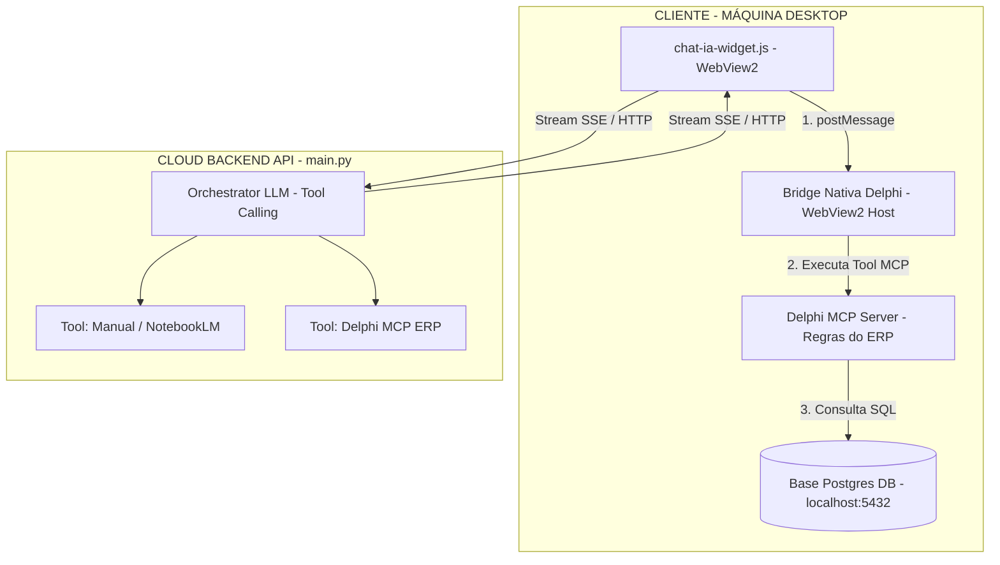

```mermaid
graph TD
    subgraph CLIENTE[CLIENTE - MÁQUINA DESKTOP]
        WIDGET[chat-ia-widget.js - WebView2]
        BRIDGE[Bridge Nativa Delphi - WebView2 Host]
        MCP[Delphi MCP Server - Regras do ERP]
        POSTGRES[(Base Postgres DB - localhost:5432)]
    end

    subgraph CLOUD[CLOUD BACKEND API - main.py]
        ORCHESTRATOR[Orchestrator LLM - Tool Calling]
        TOOL_MANUAL[Tool: Manual / NotebookLM]
        TOOL_DELPHI[Tool: Delphi MCP ERP]
    end

    WIDGET -->|Stream SSE / HTTP| ORCHESTRATOR
    ORCHESTRATOR -->|Stream SSE / HTTP| WIDGET
    WIDGET -->|1. postMessage| BRIDGE
    BRIDGE -->|2. Executa Tool MCP| MCP
    MCP -->|3. Consulta SQL| POSTGRES

    ORCHESTRATOR --> TOOL_MANUAL
    ORCHESTRATOR --> TOOL_DELPHI
```