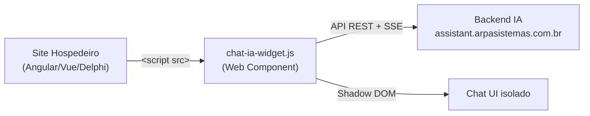

# Widget de Chat IA Embeddable (Incorporável)

Criar um componente de chat auto-contido (Vanilla JS + CSS) que pode ser incorporado em **qualquer** projeto (Angular, Vue.js, React, Delphi WebView2, HTML puro) via uma simples tag `<script>`. O chat opera com um **agente fixo** (sem troca de agente), recebendo dados de autenticação e ID do agente como parâmetros.

## Arquitetura

O widget será um **Web Component** (Custom Element + Shadow DOM) servido como arquivo estático pelo próprio projeto Next.js (`agentes-suporte-ia-dash`). Isso garante:

- **Isolamento total de CSS**: Shadow DOM impede conflitos de estilo com o site hospedeiro
- **Compatibilidade universal**: Custom Elements são suportados por todos os browsers modernos (incluindo Edge/WebView2 do Delphi)
- **Zero dependências**: Vanilla JS puro, sem React/MUI/axios — tudo inline
- **Deploy simples**: Mesmo domínio que já serve o dashboard (`dashia.arpasistemas.com.br`)



## User Review Required

> [!IMPORTANT]
> **API URL hardcoded vs. parâmetro**: O widget vai apontar por padrão para `https://assistant.arpasistemas.com.br`. Em dev, pode-se sobrescrever via atributo `api-url="http://localhost:8000"`. Está OK?

> [!IMPORTANT]
> **API Key**: O `.env` mostra uma `NEXT_PUBLIC_BACKEND_API_KEY`. Esse token será embutido no script do widget? Isso o exporia no cliente. Alternativas:
> 1. Passar como atributo `api-key="sk-..."` (o site hospedeiro já controla acesso)
> 2. Remover a necessidade de API key para endpoints do chat (já que o backend valida por thread/email)
> 3. Manter como está — o token já é público (`NEXT_PUBLIC_*`)
>
> **Recomendo manter como atributo (opção 1)**, pois cada projeto pode ter sua key.

> [!WARNING]
> **CORS**: O backend (`assistant.arpasistemas.com.br`) precisará aceitar requests de domínios diferentes (ex: `localhost:4200` do Angular, domínio do Delphi, etc.). Se CORS não estiver configurado no backend, o widget não funcionará cross-origin. Verifique se o backend já tem `Access-Control-Allow-Origin: *` ou se precisa ser ajustado.

## Open Questions

1. **Consentimento de privacidade**: O ChatIA atual mostra um aviso de privacidade/IA no primeiro uso. O widget embeddable deve mostrar o mesmo aviso, ou o site hospedeiro já trata isso?

2. **Posição do FAB**: No widget embeddable, o botão flutuante fica fixo no canto inferior direito por padrão. Deseja que seja possível configurar a posição via atributos (ex: `position="bottom-left"`)?

## Proposed Changes

### Widget Embeddable (arquivo único servido como estático)

#### [NEW] [chat-ia-widget.js](file:///Users/arpasistemas/dev/agentes-suporte-ia-dash/public/chat-ia-widget.js)

Arquivo ~1500 linhas, Vanilla JS puro, contendo:

- **Custom Element `<chat-ia-widget>`** com Shadow DOM
- **Atributos configuráveis**:
  - `agent-id` — ID do agente (obrigatório), ex: `"a1189726-1fe9-4e7e-a3d9-dfc226aa1b90"`
  - `agent-name` — Nome do agente (obrigatório), ex: `"VIMBO"`
  - `agent-title` — Título exibido no header, ex: `"Sistema Vimbo"` (default: `agent-name`)
  - `user-email` — Email do usuário logado
  - `user-name` — Nome do usuário logado
  - `user-cnpj` — CNPJ/schemaFilial do tenant
  - `api-url` — URL base da API (default: `https://assistant.arpasistemas.com.br`)
  - `api-key` — Chave de API (opcional)
  - `accent-color` — Cor principal do widget (default: `#bd4140`)
  - `position` — `bottom-right` (default) ou `bottom-left`
- **Funcionalidades** (porta 1:1 do ChatIA.tsx):
  - Criar novo chat (thread) — sem seleção de agente (fixo)
  - Enviar mensagens com streaming SSE (token por token)
  - Fallback para endpoint não-streaming
  - Histórico de conversas (paginado, scroll infinito)
  - Excluir conversa do histórico
  - Feedback por mensagem (thumbs up/down + texto)
  - Rating por estrelas da conversa
  - Aviso de consentimento de privacidade/IA
  - SSE para mensagens do auditor
  - Expandir/recolher (fullscreen)
  - Markdown rendering (parser leve inline, sem `react-markdown`)
  - Responsivo (mobile/desktop)
- **CSS**: Todo inline no Shadow DOM via `<style>` — design inspirado no ChatIA atual (dark theme, gradientes, animações)

### Integração no Angular (Vimbo)

#### [MODIFY] [empresa.component.ts](file:///Users/arpasistemas/dev/vimbo/new-pwa-vimbo/src/app/main/apps/dashboards/empresa/empresa.component.ts)

- Adicionar `CUSTOM_ELEMENTS_SCHEMA` ao módulo/componente para permitir `<chat-ia-widget>`
- Inserir o `<script>` dinamicamente no `ngOnInit` (ou via `angular.json`)
- Passar os parâmetros do usuário logado (`this.user`) como atributos do elemento

#### [MODIFY] [empresa.component.html](file:///Users/arpasistemas/dev/vimbo/new-pwa-vimbo/src/app/main/apps/dashboards/empresa/empresa.component.html)

- Adicionar o `<chat-ia-widget>` com bindings dos atributos:
```html
<chat-ia-widget
  agent-id="a1189726-1fe9-4e7e-a3d9-dfc226aa1b90"
  agent-name="VIMBO"
  agent-title="Sistema Vimbo"
  [attr.user-email]="user?.userAuthentication?.username"
  [attr.user-name]="user?.userAuthentication?.nome"
  [attr.user-cnpj]="user?.userAuthentication?.tenantId?.schemaFilial"
  api-url="https://assistant.arpasistemas.com.br"
></chat-ia-widget>
```

#### [MODIFY] Módulo Angular (empresa.module.ts ou equivalente)

- Adicionar `CUSTOM_ELEMENTS_SCHEMA` aos schemas do módulo

---

## Como incorporar em qualquer projeto

### 1. HTML / JavaScript puro
```html
<script src="https://dashia.arpasistemas.com.br/chat-ia-widget.js"></script>
<chat-ia-widget
  agent-id="a1189726-1fe9-4e7e-a3d9-dfc226aa1b90"
  agent-name="VIMBO"
  agent-title="Sistema Vimbo"
  user-email="admin@empresa.com.br"
  user-name="João Silva"
  user-cnpj="03600477000104"
  api-url="https://assistant.arpasistemas.com.br"
></chat-ia-widget>
```

### 2. Angular
```typescript
// No módulo:
@NgModule({
  schemas: [CUSTOM_ELEMENTS_SCHEMA],
  // ...
})

// No component ou index.html:
// <script src="https://dashia.arpasistemas.com.br/chat-ia-widget.js"></script>
```

```html
<!-- No template -->
<chat-ia-widget
  agent-id="a1189726-1fe9-4e7e-a3d9-dfc226aa1b90"
  agent-name="VIMBO"
  [attr.user-email]="user?.userAuthentication?.username"
  [attr.user-name]="user?.userAuthentication?.nome"
  [attr.user-cnpj]="user?.userAuthentication?.tenantId?.schemaFilial"
></chat-ia-widget>
```

### 3. Vue.js
```html
<script src="https://dashia.arpasistemas.com.br/chat-ia-widget.js"></script>
<chat-ia-widget
  :agent-id="'a1189726-1fe9-4e7e-a3d9-dfc226aa1b90'"
  :agent-name="'VIMBO'"
  :user-email="loggedUser.email"
  :user-name="loggedUser.nome"
  :user-cnpj="loggedUser.cnpj"
></chat-ia-widget>
```

```javascript
// vue.config.js — ignorar custom elements
app.config.compilerOptions.isCustomElement = tag => tag === 'chat-ia-widget';
```

### 4. Delphi WebView2 (Edge)
```delphi
// Injetar via JavaScript no WebView2:
WebView.ExecuteScript(
  'var s = document.createElement("script"); ' +
  's.src = "https://dashia.arpasistemas.com.br/chat-ia-widget.js"; ' +
  'document.head.appendChild(s); ' +
  'setTimeout(function() { ' +
  '  var w = document.createElement("chat-ia-widget"); ' +
  '  w.setAttribute("agent-id", "a1189726-1fe9-4e7e-a3d9-dfc226aa1b90"); ' +
  '  w.setAttribute("agent-name", "VIMBO"); ' +
  '  w.setAttribute("user-email", "' + UserEmail + '"); ' +
  '  w.setAttribute("user-name", "' + UserName + '"); ' +
  '  w.setAttribute("user-cnpj", "' + UserCNPJ + '"); ' +
  '  document.body.appendChild(w); ' +
  '}, 500);'
);
```

## Verification Plan

### Manual Verification
1. Abrir `localhost:3000/chat-ia-widget.js` e verificar que o arquivo é servido corretamente
2. Criar uma página HTML simples com a tag `<script>` + `<chat-ia-widget>` apontando para `localhost:8000` e testar:
   - FAB aparece no canto inferior direito
   - Clicar abre o chat com aviso de consentimento
   - Após aceitar, cria thread automaticamente (sem seleção de agente)
   - Enviar mensagem e receber resposta via streaming
   - Histórico carrega e permite selecionar conversa anterior
   - Expandir/recolher funciona
   - Rating e feedback por mensagem funcionam
3. Testar no Angular (Vimbo) — verificar que o widget aparece no dashboard da empresa e interage corretamente
4. Verificar isolamento de CSS — o widget não deve afetar os estilos do site hospedeiro

### Compatibilidade
- Chrome, Firefox, Safari, Edge (WebView2)
