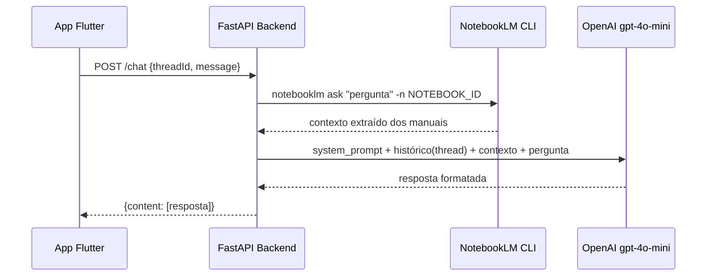

# Análise: Papel do OpenAI na Arquitetura do Agente de Suporte

## Arquitetura Atual



---

## Sua análise está CORRETA ✅

O OpenAI **não é responsável pelo conhecimento** - ele não tem os manuais do sistema. O NotebookLM faz **100% da busca e extração de conteúdo**. O papel real do OpenAI aqui é:

| Função | Quem faz |
|---|---|
| Busca no conteúdo dos manuais (RAG) | **NotebookLM** |
| Formatação e concordância do texto | **OpenAI** |
| Controle de histórico por thread (isolamento multi-sessão) | **OpenAI** (via `sessions[]`) |
| Persona e regras de comportamento (SYSTEM_PROMPT) | **OpenAI** |

---

## Por que HISTORY_LIMIT = 0 é obrigatório

O NotebookLM tem **um único notebook compartilhado** entre todos os usuários simultâneos. Ele **não tem conceito nativo de sessão/thread** - cada chamada `notebooklm ask` é stateless.

Se você passasse histórico para o NotebookLM, ocorreria:
- Contaminação entre sessões (contexto de usuário A afetando usuário B)
- Impossibilidade de N usuários simultâneos com contextos isolados

**Solução atual:** o histórico fica no backend (`sessions[thread_id]`), isolado por UUID de thread, e é injetado apenas nas chamadas ao OpenAI. O NotebookLM sempre recebe **somente a pergunta atual**, sem histórico.

---

## O OpenAI resolve exatamente este problema

```
sessions = {
  "uuid-user-A": [msg1, msg2, msg3],   # histórico isolado
  "uuid-user-B": [msg1],               # sem interferência
  "uuid-user-C": [...],
}
```

O `thread_id` (UUID gerado pelo `/createNewThread`) garante que cada usuário Flutter tem seu próprio histórico de conversa gerenciado pelo backend, enviado como contexto para o OpenAI em cada requisição.

---

## Poderia remover o OpenAI? Análise de alternativas

### Opção A: Retornar direto o output do NotebookLM (sem OpenAI)
- ✅ Custo zero
- ✅ Sem risco de alucinações
- ❌ **Sem histórico de conversa** - cada pergunta é independente
- ❌ Sem formatação/ajuste de linguagem
- ❌ Sem SYSTEM_PROMPT (persona, regras de comportamento)
- ❌ Não resolve o isolamento de sessão (todas as threads veriam o mesmo estado)

### Opção B: Usar outro LLM local (Ollama/Llama) no lugar do OpenAI
- ✅ Custo zero após setup
- ✅ Mantém isolamento de sessão
- ⚠️ Qualidade inferior ao gpt-4o-mini para formatação em PT-BR
- ⚠️ Requer hardware/servidor adicional

### Opção C: Arquitetura Atual (OpenAI + NotebookLM) ← RECOMENDADA
- ✅ NotebookLM faz RAG nos manuais (conhecimento real)
- ✅ OpenAI formata, ajusta concordância e mantém isolamento de sessão por thread
- ✅ SYSTEM_PROMPT reforça que o modelo NÃO pode inventar conteúdo
- ⚠️ Custo da API OpenAI (mas gpt-4o-mini é barato)

---

## Conclusão

**Sim, o OpenAI serve principalmente para:**

1. **Isolamento de contexto por thread** - o problema central com múltiplos usuários simultâneos no mesmo notebook
2. **Ajuste de linguagem** - formatar e corrigir a concordância do texto extraído pelo NotebookLM
3. **Guardrails via SYSTEM_PROMPT** - garantir que o assistente não invente respostas

> [!NOTE]
> Com `HISTORY_LIMIT = 0`, o histórico existe no backend mas **não é enviado para o OpenAI**. Isso significa que, na prática, o OpenAI também não tem memória de conversa - ele recebe apenas a pergunta atual + contexto do NotebookLM. Se você quiser que o usuário possa fazer perguntas de acompanhamento ("e sobre o passo 2?"), precisaria aumentar o `HISTORY_LIMIT` para pelo menos `10` (5 turnos = 10 mensagens).

> [!IMPORTANT]
> A arquitetura atual com `HISTORY_LIMIT = 0` significa que cada pergunta é completamente independente da anterior, mesmo dentro da mesma thread. O usuário não pode fazer perguntas como "pode me dar mais detalhes sobre isso?" porque o OpenAI não saberá o que é "isso".
