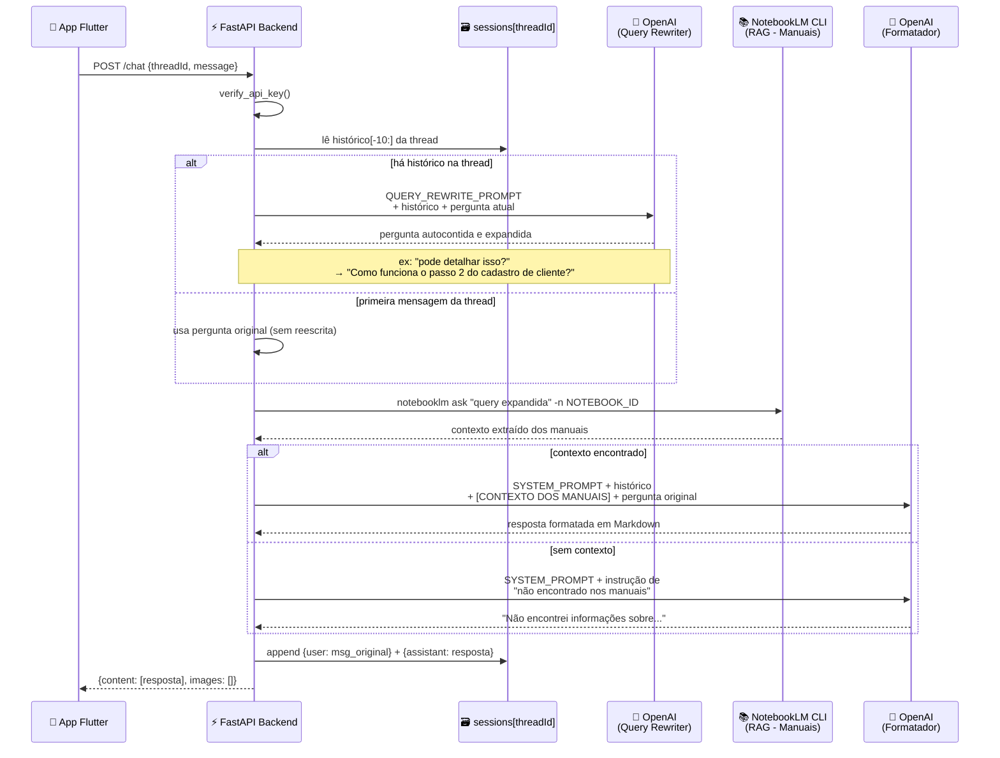
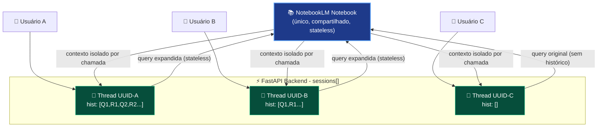
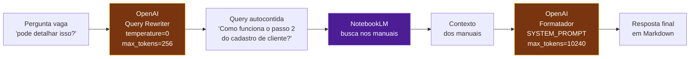

# Arquitetura - Agente de Suporte Smart (pós Query Rewriting)

## Fluxo Principal por Requisição

---

## Isolamento de Sessões Multi-Usuário

---

## Responsabilidades por Componente

| Componente | Papel | Estado |
|---|---|---|
| **Flutter App** | Interface do usuário | stateless |
| **FastAPI Backend** | Orquestrador, autenticação, histórico por thread | **stateful** (RAM) |
| **sessions[threadId]** | Histórico isolado por usuário (até 10 msgs) | em memória |
| **OpenAI - Query Rewriter** | Expande perguntas vagas usando histórico | stateless |
| **NotebookLM CLI** | RAG - busca real nos manuais do sistema | **stateless** |
| **OpenAI - Formatador** | Ajusta gramática, aplica SYSTEM_PROMPT, formata Markdown | stateless |

---

## Por que dois papéis do OpenAI?

> [!NOTE]
> O **Query Rewriter** usa `temperature=0` para garantir resultados conservadores e determinísticos - ele nunca inventa contexto, apenas reorganiza o que já está no histórico da conversa.

> [!IMPORTANT]
> O NotebookLM **sempre recebe uma pergunta isolada e autocontida** - jamais recebe o histórico de conversa diretamente. Isso garante zero contaminação entre sessões de usuários diferentes que compartilham o mesmo notebook.
