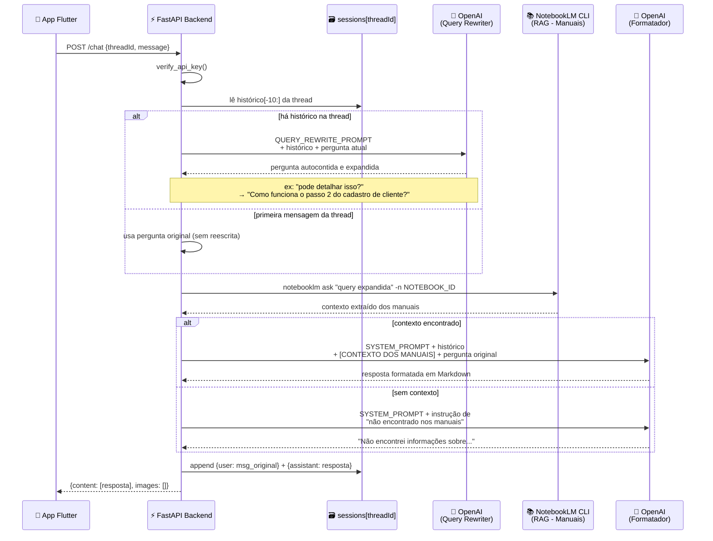

```mermaid
sequenceDiagram
    participant User as 📱 App Flutter
    participant API as ⚡ FastAPI Backend
    participant Mem as 🗃️ sessions[threadId]
    participant OAI1 as 🤖 OpenAI<br/>(Query Rewriter)
    participant NLM as 📚 NotebookLM CLI<br/>(RAG - Manuais)
    participant OAI2 as 🤖 OpenAI<br/>(Formatador)

    User->>API: POST /chat {threadId, message}
    API->>API: verify_api_key()

    API->>Mem: lê histórico[-10:] da thread

    alt há histórico na thread
        API->>OAI1: QUERY_REWRITE_PROMPT<br/>+ histórico + pergunta atual
        OAI1-->>API: pergunta autocontida e expandida
        Note over API,OAI1: ex: "pode detalhar isso?"<br/>→ "Como funciona o passo 2 do cadastro de cliente?"
    else primeira mensagem da thread
        API->>API: usa pergunta original (sem reescrita)
    end

    API->>NLM: notebooklm ask "query expandida" -n NOTEBOOK_ID
    NLM-->>API: contexto extraído dos manuais

    alt contexto encontrado
        API->>OAI2: SYSTEM_PROMPT + histórico<br/>+ [CONTEXTO DOS MANUAIS] + pergunta original
        OAI2-->>API: resposta formatada em Markdown
    else sem contexto
        API->>OAI2: SYSTEM_PROMPT + instrução de<br/>"não encontrado nos manuais"
        OAI2-->>API: "Não encontrei informações sobre..."
    end

    API->>Mem: append {user: msg_original} + {assistant: resposta}
    API-->>User: {content: [resposta], images: []}
```